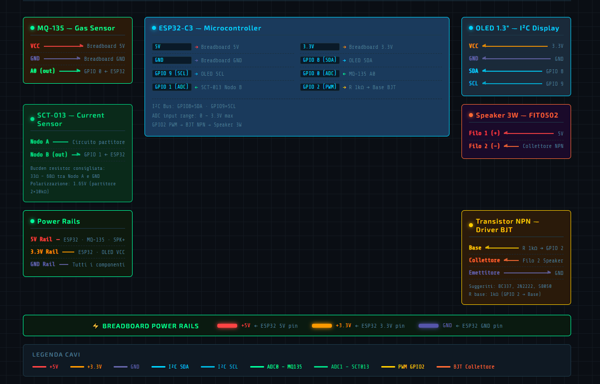

# ZephyrusTech

  

  Sistema di monitoraggio energetico e qualita aria per ambienti scolastici.

  
  
  
  

## Panoramica

ZephyrusTech e una piattaforma prototipale che unisce sensori ambientali e monitoraggio energetico per offrire una vista chiara e immediata dello stato delle aule.

## Funzionalita Principali

- Monitoraggio qualita aria con MQ-135 (CO2 equivalente)
- Misura consumi elettrici con SCT-013
- Simulazione 3D dell'aula con dispositivi e sensori
- Dashboard con grafici, soglie e alert
- Sezione componenti con schede e dettagli tecnici
- Schemi elettrici consultabili in alta risoluzione
- Confronto Arduino vs soluzioni custom e architettura espandibile

## Anteprima Visiva

## Stack Tecnologico

- Vite
- TypeScript
- Three.js
- Chart.js

## Note

I dati e i grafici sono simulati a scopo dimostrativo.

---
